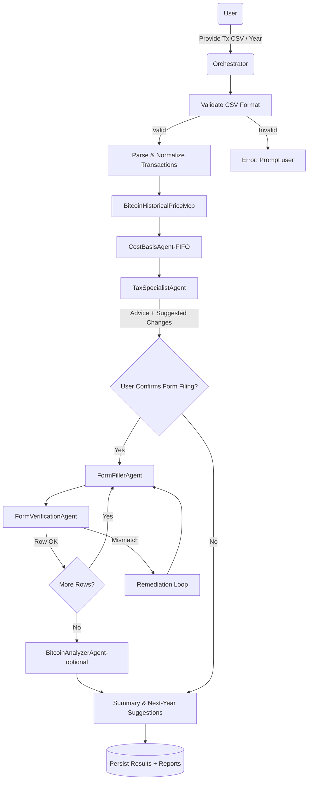
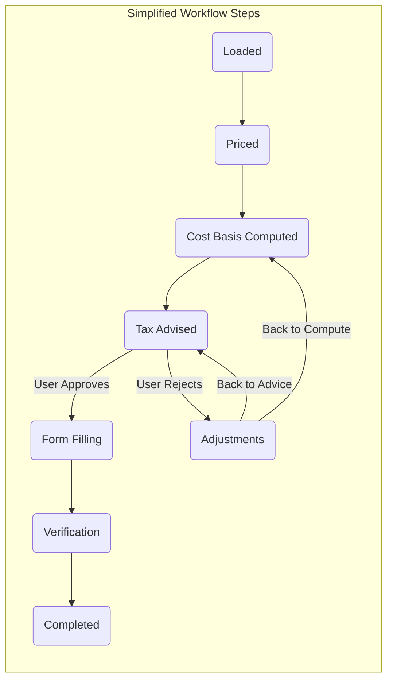
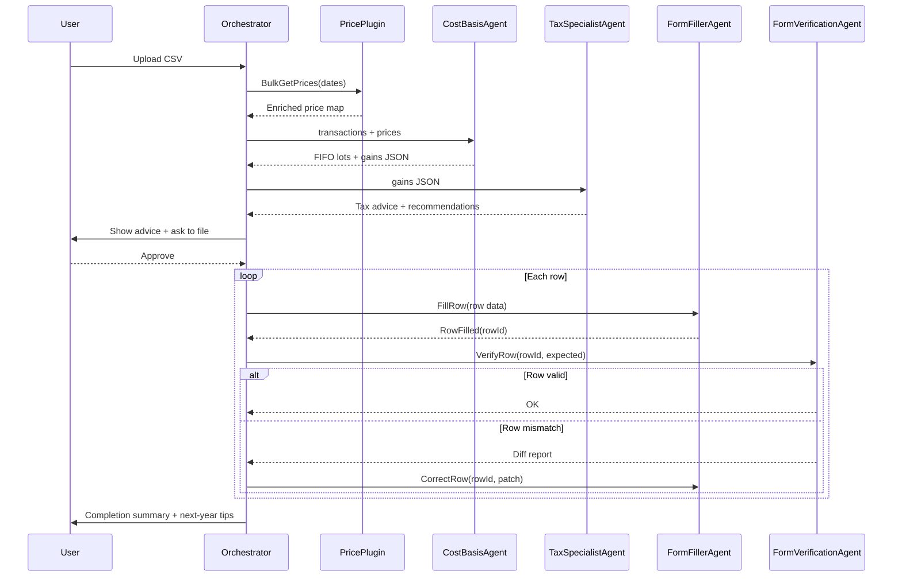

# Bitcoin Cost Basis AI Agent System

## Agents

- Bitcoin Cost Basis Orchestrator Agent
  - takes in rows of data as csv in a described F# type (date bought, date sold, amount bought, amount sold)
  - verifies type is matched
  - use BitcoinHistoricalPriceMcp to get historical prices and line them up with the transactions
  - calculate cost basis using FIFO method
  - calls the Bitcoin Tax Specialist Agent to get tax advice
  - reports suggestions on changes 
  - asks the user if they want to run the Fill form with Playwright Agent to fill in the tax form
  - calls the Verify filled form Agent to check the filled in form is correct
  - outputs the results to a file or console
  - asks the Bitcoin Tax Specialist Agent for things to do differently for the next year 

- Bitcoin Tax Specialist Agent
  - knows the Bitcoin tax rules and gives advice

- Fill form with Playwright Agent
  - structured input - JSON
  - optional agent
  - take the data and fill in the Capital Gains form (is this even possible? we shall see)
  - asks for confirmation before filling in the row
  - ask for verification after filling in the row
  - can it be generic or have to be specific to my tax software?

- Verify filled form Agent
  - check the filled in form is correct with the data given

### Other Miscellaneous Agents

Maybe I could make this a larger web of agents...
- Bitcoin Analyzer
  - how much have I increased in Sats/USD?
  - What if I sold now?
  - reporting over time with graphs based on transactions
- Bitcoin Maximalist Expert
  - not really needed ask questions, inspiration, longer term thinking
  - security suggestions
  - it doesn't add much value to Cost basis and taxes, but maybe it can add some commentary
  - complain that there shouldn't be taxes on Bitcoin transactions

## Workflows generated by Copilot





### Lifecycle

```
Loaded -> Priced -> CostBasisComputed -> TaxAdvised
 -> (If user approves) FormFilling -> Verification -> Completed
 -> (If reject) Adjustments (back to CostBasisComputed or TaxAdvised)
```

### 


